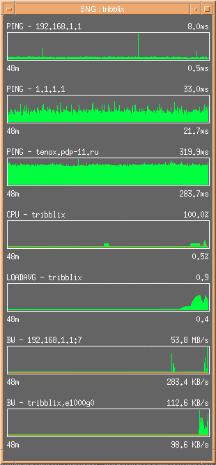
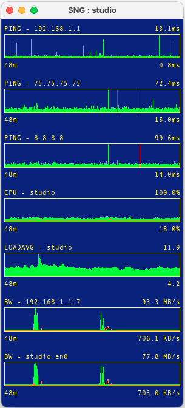
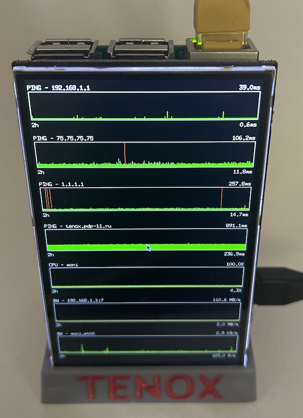

# SNG - System & Network Grapher

Simple, portable, network and system stats plotting tool. 

Supports multiple graphs with:

- Ping / ICMP Echo
- SNMP and local interface bandwidth throughput
- Some local stats like CPU, Mem, Load Avg
- Shell commands




## Supported OS

- macOS/osx
- FreeBSD
- Linux
- Solaris
- HP-UX
- AIX
- UnixWare
- IRIX
- Tru64

## Supported Graphics/UI backends

- X11
- GTK
- SDL
- GLFW

## Elevated permissions

ICMP Echo/Ping requires elevated (root) privileges. To get ping working you will need to run SNG either with:

Sudo:

```
sudo /path/to/sng
```

Setuid:

```
sudo chmod +s /path/to/sng
```

Setcap:

```
sudo setcap cap_net_raw+ep /path/to/sng
```

Sysctl ping group:

```
sudo sysctl -w net.ipv4.ping_group_range="0 2147483647"
```

Sysctl ping group - permanently:

```
sudo sh -c 'echo "net.ipv4.ping_group_range = 0 2147483647" >> /etc/sysctl.conf'
```

Unprivileged ping via shell command (lame!):

```
[targets]
shell=ping -i 10 1.1.1.1 | sed -l 's/^.*time=//g; s/ ms//g'
```

## Config file

If `sng.ini` doesnt exist the app will create you a sample one on start.

The app looks at current working directory then various system config locations like `$XDG_CONFIG_HOME`, eg `$HOME/.config/sng/sng.ini` or `~/Library/Preferences` on macOS.

You can also specify the location with `-f /full/path/to/sng.ini`

## Config Directives

**[global]**
- `background_color`, `text_color`, `border_color`, `line_color`, `line_color_secondary`, `error_line_color` - hex RGB (e.g., `00ff00`)
- `default_height`, `default_width` - pixels
- `refresh_interval_sec` - seconds
- `window_margin` - pixels
- `max_fps` - frames per second
- `fullscreen` - `0`, `1`, `force`
- `fps_counter` - `0`, `1`
- `font_size` - float or font name
- `font_name` - font family name

**[targets]**
- `ping=<host>` - ICMP echo (e.g., `ping=1.1.1.1`)
- `bw=local,<interface>` - local interface throughput (e.g., `bw=local,eth0`)
- `bw=snmp1,<host>,<community>,<ifidx>` - SNMP bandwidth (e.g., `bw=snmp1,192.168.1.1,public,7`)
- `cpu=local` - CPU usage percentage
- `memory=local` - memory usage percentage
- `loadavg=local` - load average
- `shell=<command>` - shell command output (e.g., `shell=ping -i 10 1.1.1.1 | sed 's/.*time=//;s/ ms//'`)

**[plot name]**
- `line_color`, `line_color_secondary`, `background_color` - hex RGB
- `height` - pixels
- `refresh_interval_sec` - seconds

## Performance Considerations

This app is meant to be running in background or on a stand alone display. As such, its optimized to consume as little resources as possible rather than be a fast and responsive UI.

SNG supports many UI/Graphics backends. Not all of them behave nicely. If you care about low CPU usage, wasted cycles, power usage - prefer GFX=X11, then GTK3. Avoid SDL - it's not a GUI framework but a multimedia/game library designed for high performance.  It's pretty hard to make it yeld CPU back. SDL will use more CPU cycles on idle.

## Devices

I run SNG on Raspberry PI with [HyperPixel4](https://shop.pimoroni.com/products/hyperpixel-4?variant=12569485443155) display. This display is super crisp and sharp but doesn't use HDMI video. Instead has it's own driver, which is good, but works with Raspbian only.



To auto start add this:

```
cat > .config/autostart/sng.desktop <<EOF
[Desktop Entry]
Type=Application
Name=sng
Comment=sng
Exec=lxterminal -e /path/to/sng.sh
NotShowIn=GNOME;KDE;XFCE
EOF
```

sng.sh

```
xset s noblank
xset s off
exec /path/to/sng -f /path/to/sng.ini
```

You will also need to make it suid, setcap, or sysctl ping group.

Also you should switch from Wayland to Xorg in `raspi-config`.

## Development libraries

### SDL2

```
apt install libsdl2-dev libsdl2-ttf-dev libfontconfig1-dev 
```

### SDL3

```
apt install libsdl3-dev libsdl3-ttf-dev libfontconfig1-dev
```

### GTK3

```
apt install libgtk-3-dev libfontconfig1-dev
```

### X11

```
apt install libx11-dev xfonts-base xfonts-traditional
```

restart X may be required

### Misc

```
apt install fontconfig pkg-config
```

## Prior art

SNG is inspired by:

- [SunOS Performance Meter](https://web.archive.org/web/20121207213342/https://docs.oracle.com/cd/E19683-01/806-4743/perfmeterusing-64/index.html)
- DEC Unix / Tru64 `cpuinfo`
- [xosview](https://xosview.sourceforge.net/) and originally IRIX gr_osview
- Plan 9 `stats`, `gping` 
- [STG](http://leonidvm.chat.ru/)
- [SRG](https://sourceforge.net/projects/snmprg/)
- [Conky](https://github.com/brndnmtthws/conky)
- [GKrellM](https://gkrellm.srcbox.net/)

